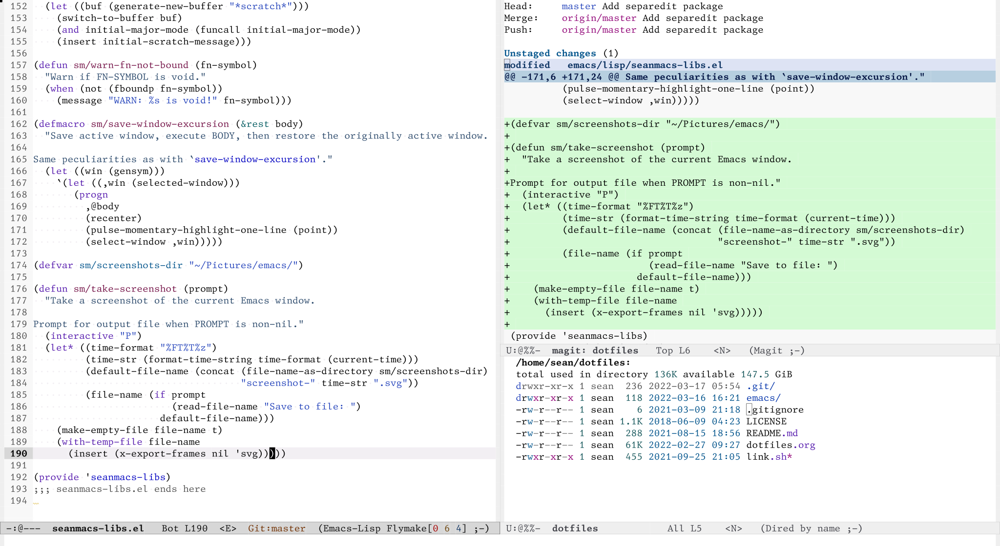

# Dotfiles

Repository for easy syncing of my dotfiles.

## Emacs

Running `link.sh` will symlink emacs files to `~/.emacs.d`.

## Everything else

Configuration for everything else lives in
[dotfiles.org](./dotfiles.org). Tangling will export all files to where they
expect to be found.
