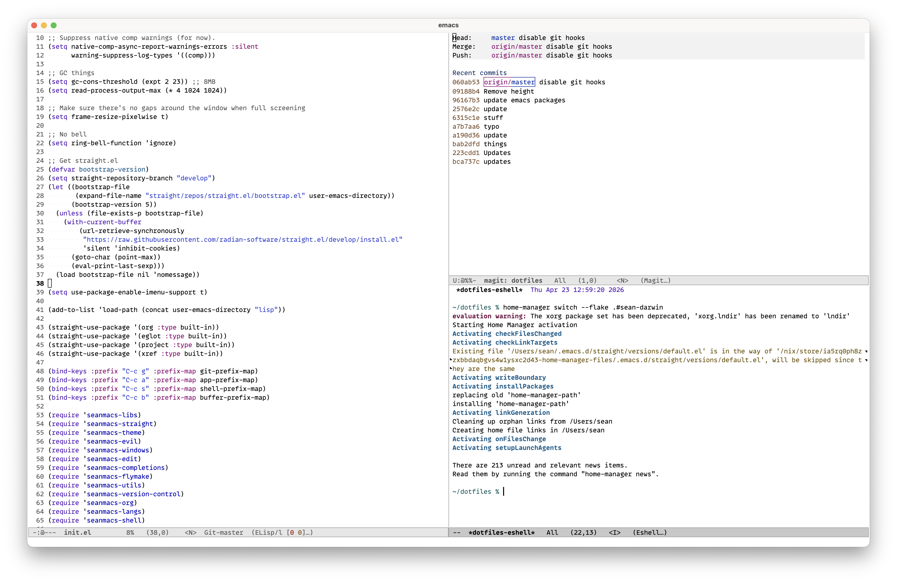

# Dotfiles

My dotfiles using nix.

## Home-manager

Install home-manager using flakes as described [here](https://nix-community.github.io/home-manager/index.html#sec-flakes-standalone).

Switching to a new home-manager revision:

``` shell
home-manager switch --flake .#sean-darwin
```

## Updating inputs

Update nixpkgs:

```shell
nix flake lock --update-input nixpkgs
```

Update home-manager:

```shell
nix flake lock --update-input home-manager
```

## Emacs

Emacs configuration will be placed in `~/.emacs.d` when running `home-manager
switch ...`.



